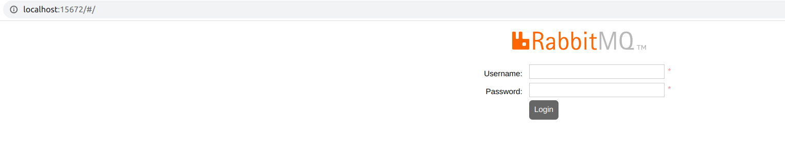
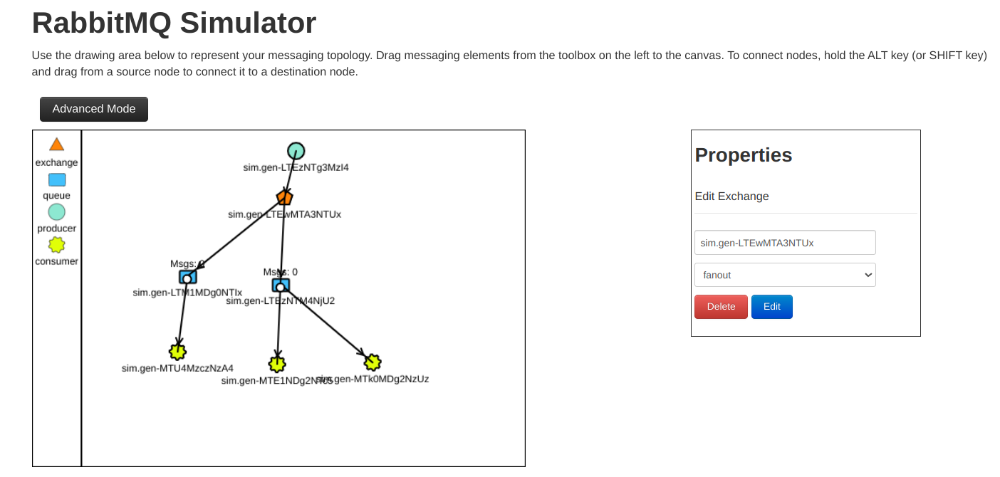

# RabbitMQ

-> Content and tips taken from the book: RabbitMQ in Action: Distributed Messaging for Everyone

## Setup:
- [x] Docker
- [x] Docker-Compose
- [x] Install python > Python2.7 
- [x] K8s

---

# 01 - Dev Enviroment
## Create a Image to RabbitMQ
```
docker build -t testemq --file dockerFileRabbitMq .
```

## Run container
```
docker run --name rabbit -p 5672:5672 -p 15672:15672 -d  testemq:latest
```

## See the RabbitMQ UI
```
http://localhost:15672/

user: guest
password: guest
```


## Add a new VHost:
- Go in tab 'Admin'
- In menu (right) choice 'VirtualHost'
- Click in 'Add a new virtual host'
- Input Name: dev-host

## Add a new Queue:
- Go in tab 'Queue'
- Click in 'Add a new queue'
- Input Name: test-queue

## Add in Message:
- Click in queue 'test-queue'
- Click in 'Publish message'
- input payload: teste
- click in button 'Publish Message'

## View Message:
- Refresh page
- Click in tab 'queue'
- click in queue 'test-queue'
- Click in 'Get Messages'
- click in button 'Get Messages'

# 02 - How use Consumer

## Create consumer:

## Tips:
- You can understand messages and broker : http://tryrabbitmq.com/
